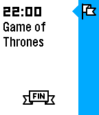
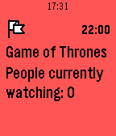
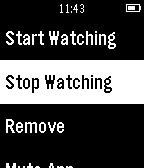

# Timeline TV Tracker Example

This example demonstrates the usage of topics and shared pins in the [Pebble timeline API][timeline-guides]. We also have [other examples][pebble-examples] showing you how to create user pins and push them directly from [PebbleKit JS][pebblekit-js].

## Getting Started

Start by cloning this repository to your local machine.

```sh
git clone https://github.com/pebble-examples/timeline-tv-tracker.git
```
Generate your unique `UUID` with `uuidgen` and replace it in [appinfo.json](./pebble/appinfo.json). Then follow our [Enabling the Timeline][timeline-enabling-guide] guide to get your timeline tokens in order for the app to be able to send pins.

```sh
uuidgen # copy the UUID returned by uuidgen and replace it in appinfo.json
```

Build the Pebble app and run it on the Basalt emulator.

```sh
cd timeline-tv-tracker/pebble/
pebble build
pebble install --emulator basalt
```

Launch the Node.js backend application.

```sh
cd timeline-tv-tracker/node/
npm install
export PEBBLE_TIMELINE_API_KEY=4e8d87150e2e6c12057da0e34c4d968e # the API key you got from the Pebble Developer Portal
node app.js
```

Launch the app on the emulator. You should see a message telling you that you've subscribed to the `GameOfThrones` topic and that a pin has been sent to your timeline. Exit the app and press down to view the timeline. You should see your pin! (You may have to wait a minute or two and then exit and reload the timeline to see the pin.)

The pin will tell how many people are currently watching and you can use the actions to increase or decrease that number. Since this is a shared pin, the actions will update the pin on everyone's timeline who is subscribed to the `GameOfThrones` topic.

## Screenshots

&nbsp;
&nbsp;
&nbsp;

## Learning More

If you want to learn more about the new Pebble timeline API, check out our [Hello Timeline](https://github.com/pebble-examples/hello-timeline) example demonstrating the usage of single user pins and how to use actions. You should also take a look at the [timeline guides on the Pebble developer website][timeline-guides].

## License

[MIT](./LICENSE)

[pebble-examples]: https://github.com/pebble-examples
[pebblekit-js]: https://developer.getpebble.com/guides/js-apps/pebblekit-js
[timeline-guides]: https://developer.getpebble.com/guides/timeline/
[timeline-enabling-guide]: https://developer.getpebble.com/guides/timeline/timeline-enabling/
